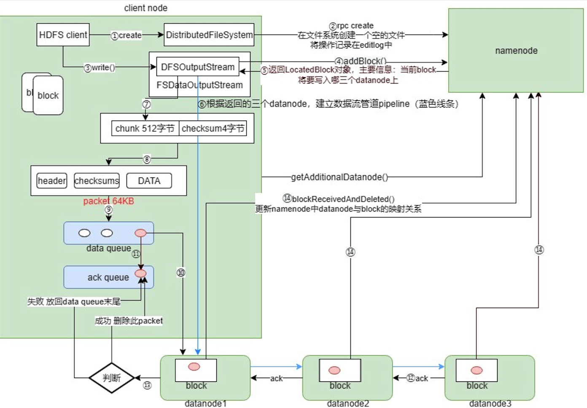
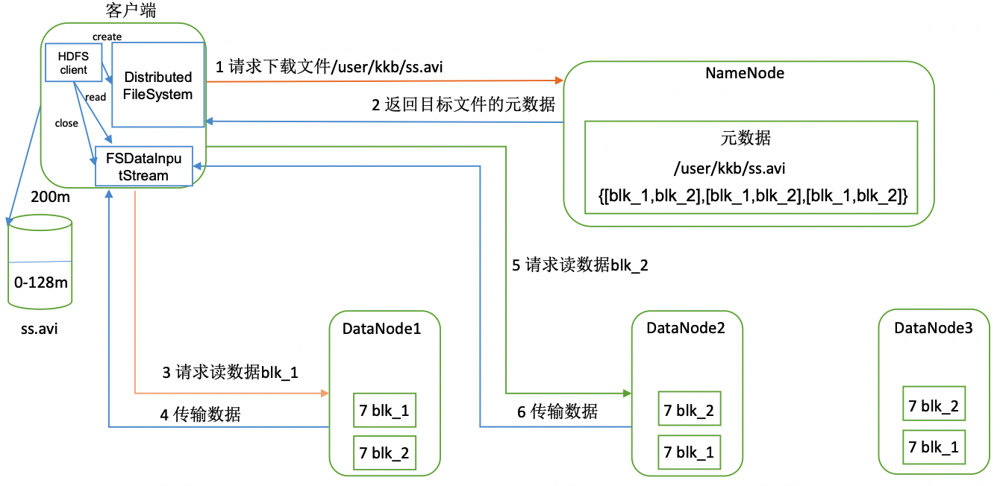

# HDFS写文件流程

当用户通过命令行或者JavaAPI向Hadoop集群发起写入文件操作时，将触发写文件流程，分为3个阶段：创建文件，建立数据流管道和写数据。

## 1. 创建文件

1. HDFS client调用DistributedFileSystem.create()
2. 上述调用向namenode发起RPC create调用，请求指定路径创建一个新文件，并将操作记录存入edits.log，该调用返回一个FSDataOutputStream对象，该对象是DFSOutputStream的wrapper

## 2. 建立数据流管道

1. HDFS client调用FSDataOutputStream.write()写block1
2. 上述write()方法向namenode发起RPC addBlock调用，请求添加一个新的数据块，namenode会返回LocatedBlock对象
3. LocatedBlock对象所含有的信息将告诉client数据会写到哪几个datanode上
4. HDFS client根据返回的datanode信息，建立数据流管道pipeline

## 3. 写数据

1. FSDataOutputStream对象开始写入数据，数据以512字节的chunk+4字节的checksum形式写入
2. 每64KB形成一个packet，packet格式为header+checksums+DATA
3. packet放入data queue队列等待被发送
4. HDFS client将packet发送给datanode1，datanode1将packet发送到datanode2，datanode2将其发送到datanode3，以此类推
5. HDFS client同时将packet写入ack queue队列
6. 最后一个datanode（即这里的datanode3）对收到的packet进行校验，然后向上一个datanode（即datanode2）发送ack，datanode2同样进行校验，然后发送ack到datanode1，datanode1做完校验发送ack给HDFS client
7. HDFS client判断收到的校验，如果成功，则删除ack queue队列中的packet，表示数据传递成功；如果失败，则将packet放回data queue进行重传
8. 重复上述过程直到整个block发送完毕，此时所有datanode都收到了block1的完整副本，它们会向namenode的远程过程调用blockReceivedAndDeleted()，通知namenode该block已经发送成功，namenode更新内存中block与datanode的对应关系
9. 关闭构建的pipeline，继续传输下一个block2时，从RPC addBlock重新开始，直到全部数据写完
10. 调用DFSOutputStream的close()方法
11. 客户端远程过程调用namenode的RPC complete()，告知namenode传输完成

## 4. 容错原理

数据传输过程中，如果datanode2突然挂掉了，HDFS会启动如下步骤进行容错。

1. 将ack queue队列中所有的packet放回data queue队列
2. HDFS client向namenode发起RPC调用updateBlockForPipeline()，为当前block生成新版本ts1（本质是时间戳）
3. 故障datanode2从pipeline中删除
4. DFSDataOutputStream发起RPC调用namenode的getAdditionalDatanode()方法，让namenode重新分配datanode，比如是datanode4
5. DFSDataOutputStream将dn1，dn2和dn4组成新管道，更新上面的block版本为ts1
6. HDFS client通知dn1和dn3将其上已完成传输的block数据拷贝到dn4，上，至此三者所获取的数据保持一致
7. 新的数据管道建立后，DFSDataOutputStream调用upadatePipeline() RPC调用更新namenode元数据
8. HDFS client按正常写入流程完成文件上传
9. 故障dn2重启后，namenode发现它上面的block时间戳是老的，就会通知dn2将其删除

# HDFS读文件流程

1. HDFS client向namenode通过远程过程调用请求下载文件
2. namenode返回目标文件元数据
3. HDFS client根据“先就近，后随机”的原则选择datanode，请求读取数据
4. datanode开始以packet为单位传输数据给客户端
5. 客户端以packet为单位接收，先本地缓存然后写入目标文件
6. 客户端再向其他datanode请求下一个block，重复上述过程

# 元数据冷备份机制

